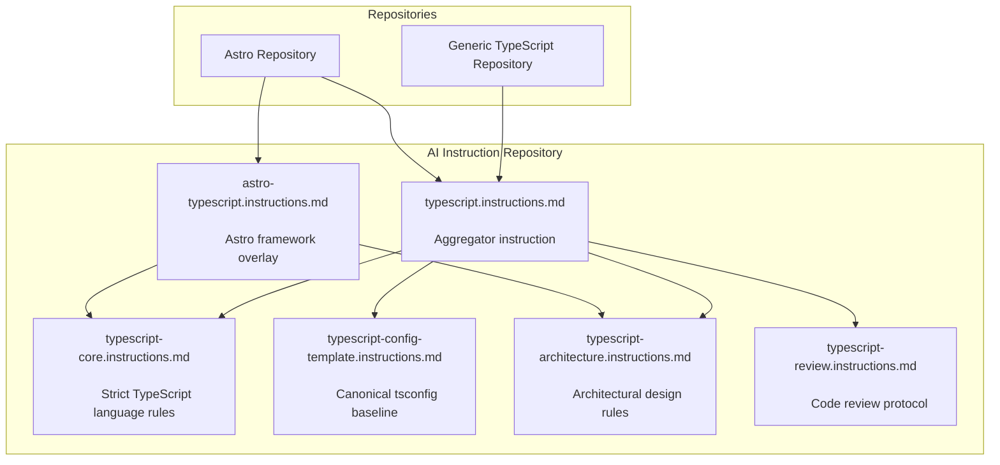

# AI files of @davidsneighbour

Agents perform work, instructions constrain behaviour, prompts request tasks, and skills provide reusable methods.

## Agents

## Instructions

### TypeScript



## Prompts

## Skills

## VS Code AI Symlink Helper

Use `scripts/ai-vscode-linker.sh` to create symlinks from this repository (expected at `~/.ai`) into the current folder's `.vscode/`.

`~/.ai` must be linked before using the linker. Run `~/.ai/linker.sh setup` first.

Examples:

```bash
# one-time setup
~/.ai/linker.sh setup

# interactive linking in current directory
linker.sh

# create .vscode automatically before linking
linker.sh --force
```

The interactive menu supports:

- linking full folders (`agents`, `instructions`, `prompts`, `skills`) to `.vscode/<name>`
- selecting single items (files or folders) in each category and linking them individually with clean display names

## Licensed content

These links into 404s are by design.

- [Tailwind Plus UI-Blocks llms.txt](https://tailwindcss.com/plus/ui-blocks/documentation/llms.txt)
- [Emil.md](https://animations.dev/learn/emil-skill)
- [Animations.dev Skill](https://animations.dev/learn/animation-theory/animations-and-ai#installation)
